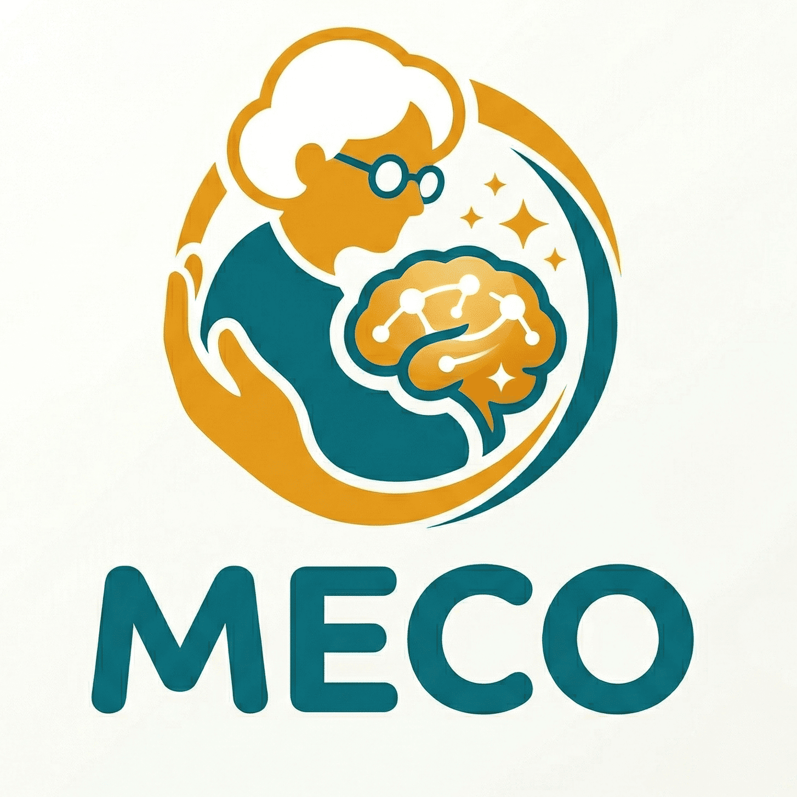

<div align="center">    </div>

# MECO: A Multimodal Dataset for Emotion and Cognitive Understanding in Older Adults

<div align="center">
   
   
  
</div>


## 📣 Introduction

Existing multimodal benchmarks predominantly target young, cognitively healthy subjects, neglecting the influence of cognitive decline on emotional expression and physiological responses. To bridge this gap, we present **MECO**, a **M**ultimodal dataset for **E**motion and **C**ognitive understanding in **O**lder adults. 

MECO includes 42 participants and provides approximately 38 hours of multimodal signals, yielding 30,592 synchronized samples. To maximize ecological validity, data collection followed standardized protocols within community-based settings. The modalities cover video, audio, electroencephalography (EEG), and electrocardiography (ECG). In addition, the dataset offers comprehensive annotations of emotional and cognitive states, including self-assessed valence, arousal, six basic emotions, and Mini-Mental State Examination (MMSE) cognitive scores.

MECO serves as a foundational resource for multimodal modeling of affect and cognition in aging populations, facilitating downstream applications such as personalized emotion recognition and early detection of mild cognitive impairment (MCI) in real-world settings. 

For more details and supplementary materials, please visit our official [Project Page](https://maitrechen.github.io/meco-page/).

---

## 📊 Overview of MECO Dataset

<div align="center">
  
</div>
<br>
<i>An overview of the MECO dataset, illustrating the multimodal data collection process, experimental paradigms, and downstream emotion/cognitive analysis tasks.</i>

## 💾 Dataset

### 1. Download

The extracted multimodal feature dataset is available via the following sources:

- **Baidu Netdisk**:  
  [https://pan.baidu.com/s/1K7ZkEpt4iseMhsqVE8fiQQ?pwd=b3yj](https://pan.baidu.com/s/1K7ZkEpt4iseMhsqVE8fiQQ?pwd=b3yj)

- **Google Drive** :  
  https://drive.google.com/file/d/1HIetl9oYDtKUQGC4IvNUUSuxjRHBtZto/view?usp=drive_link

### 2. Access Password
To protect participant privacy, the dataset archive is encrypted. To obtain the unzip password, please refer to the **"Get Data"** section on our [Project Page](https://maitrechen.github.io/meco-page/) and send a formal request email as instructed.

### 3. Organization
Once extracted, the feature dataset follows this organizational structure:

```text
MECO
├── Video/
│   ├── video_S1.pkl
│   ├── video_S2.pkl
│   └── ...
├── EEG/
│   ├── eeg_S1.pkl
│   └── ...
├── ECG/
│   ├── ecg_S1.pkl
│   └── ...
└── Subjects.xlsx
```

**Note on Metadata:** The `Subjects.xlsx` file contains essential demographic and cognitive metadata for all 42 participants. Specifically, it includes **Gender**, **Age**, **Edu** (Education Level), and **MMSE** (Mini-Mental State Examination scores).

## 🚀 Quick Start

This repository provides a highly modular, zero-data-leakage PyTorch framework designed to process MECO's multimodal signals. It supports both **Subject-Dependent (SD)** and **Subject-Independent (SI)** paradigms.

### 1. Prerequisites
The framework has been tested on **Python 3.9.20**. We highly recommend setting up a virtual environment (e.g., via `conda`). 

Clone the repository and install all required dependencies with a single command:

```bash
git clone git@github.com:MaitreChen/MECO.git
cd meco
pip install -r requirements.txt
```

### ⚙️ Configuration & Hyperparameters

**Important:** We deliberately did not heavily tune the default hyperparameters to leave room for exploration and fair comparison. Researchers are highly encouraged to adjust parameters (e.g., learning rate, epochs, batch size, feature types) inside the `configs/` directory to suit their specific architectural needs.


## 🏃‍♂️ Running the Experiments

All experimental settings are controlled via JSON configuration files. You can easily switch between Unimodal, Bimodal, or Trimodal inputs by modifying the `used_modalities` and `feature_type_*` lists in the respective config files.

### 1. Emotion Tasks (Subject-Dependent / SD)

Evaluates emotion recognition using a standard train/valid/test split within the same subject.

- **Classification (e.g., 3-class/5-class emotions):**

  ```bash
  python train_emotion_sd_cls.py --config_file configs/emotion_sd/full_cls.json
  ```

- **Regression (e.g., Arousal/Valence prediction):**

  ```bash
  python train_emotion_sd_reg.py --config_file configs/emotion_sd/full_reg.json
  ```

### 2. Emotion Tasks (Subject-Independent / SI)

Evaluates emotion recognition using K-Fold (Leave-One-Subject-Out) cross-validation to assess generalizability across unseen subjects.

- **Classification:**

  ```bash
  python train_emotion_si_cls.py --config_file configs/emotion_si/full_cls.json
  ```

- **Regression:**

  ```bash
  python train_emotion_si_reg.py --config_file configs/emotion_si/full_reg.json
  ```

### 3. Cognitive Tasks (Subject-Independent / SI)

Evaluates cognitive assessment utilizing the MMSE scores. We provide an intuitive `--pair` argument to quickly ablate modality combinations without editing the JSON files. *(Options for `--pair`: `V`, `E`, `C`, `VE`, `VC`, `EC`, `VEC`)*

- **Binary Classification (Healthy vs. MCI Screening):**

  ```bash
  python train_cog_cls.py --config_file configs/cognition_si/cog_cls.json --pair VEC
  ```

- **Regression (Continuous MMSE Score Prediction):**

  ```bash
  python train_cog_reg.py --config_file configs/cognition_si/cog_reg.json --pair VE
  ```


## 📝 Citation

If you find this dataset and framework useful for your research, please consider citing our paper:

```
@article{chen_meco2026,
      title = {MECO: A Multimodal Dataset for Emotion and Cognitive Understanding in Older Adults},
      author = {Chen, Hongbin and Li, Jie and Wang, Wei and Song, Siyang and Gu, Xiao and Li, Jianqing and Xiang, Wentao},
      journal = {arXiv preprint arXiv:2604.03050},
      doi = {10.48550/ARXIV.2604.03050},
      url = {[https://arxiv.org/abs/2604.03050](https://arxiv.org/abs/2604.03050)},
      year = {2026}
}
```


## 🙏 Acknowledgements

We would like to express our sincere gratitude to [EmoLab](https://emolab-ai.github.io/) for their invaluable support, guidance, and resources throughout the development of this project. Their contributions have been instrumental in bringing the MECO dataset and framework to life!


